# Alerts IQ: Enterprise Architecture & High-Level Design (HLD)
## AI-Powered Alert Lifecycle Management Platform

**Document Version:** 1.1  
**Status:** Approved / Architecture Standard  
**Target Audience:** Engineering Teams, DevSecOps, Product Owners, Security Compliance  

---

## 1. Executive Summary

Alerts IQ is an enterprise-grade, AI-powered alert engineering and lifecycle management platform. It allows organizations to discover, design, govern, validate, test, and publish business alerts across multiple communication channels (Email, SMS, Mobile Push, Web Notification). 

Traditionally, alert configuration is a manual, fragmented process involving separate business requirement drafting, content templating, coding of rule conditions, and manual publication into content management systems. Alerts IQ automates this into a unified, secure, and governed workflow:

```
Business Requirement ➔ Cognitive Discovery ➔ Content Design ➔ Rule Engine Association ➔ Governance Approval ➔ Automated Validation ➔ Enterprise Publishing (CMS) ➔ Telemetry Monitoring
```

The system architecture is engineered to deliver:
*   **Enterprise Scale:** High-throughput processing and rendering.
*   **High Availability:** Multi-region active-active deployment topologies.
*   **Strict Security & Governance:** Active Directory/LDAP integration, role-based access control (RBAC), and distributed resource locking.
*   **Extensibility:** Modular microservices and event-ready boundaries.
*   **Cognitive Productivity:** Native AI-assisted document parsing and natural language to rule conversion.

---

## 2. Architecture Vision & Layers

The platform is divided into five logical layers to maximize isolation, scalability, and ease of deployment:

```
+------------------------------------------------------------------------+
|                           Experience Layer                             |
|        (React Single Page Application, TypeScript, Zustand, WSS)       |
+------------------------------------------------------------------------+
        | (Direct Cognitive Path)        | (Transactional Path via Gateway)
        v                                v
+-----------------------+        +---------------------------------------+
|  Intelligence Layer   |        |       Business Capability Layer       |
|    (Python FastAPI    |        |       (Spring Boot Microservices)     |
|   CV/LLM Engines)     |        |                                       |
+-----------------------+        |  - Discovery   - Preview   - Test     |
                                 |  - Workflow    - Rule      - Integration
                                 +---------------------------------------+
                                                 |
                                                 v
                                 +---------------------------------------+
                                 |       Data & Caching Layer            |
                                 |          (MongoDB & Redis)            |
                                 +---------------------------------------+
                                                 |
                                                 v
                                 +---------------------------------------+
                                 |       Integration Services            |
                                 |  - RWS Tridion CMS    - GitLab/GitHub |
                                 |  - StoryWeaver        - Active Directory
                                 +---------------------------------------+
```

### Experience Layer
A single-page application (SPA) built using **React**, **TypeScript**, and **Zustand** for state management. It provides interactive, real-time dashboards, guided requirement forms, a side-by-side multi-channel previewer, and an AI chat interface.

### Business Capability Layer (Non-AI Core)
Implemented as a collection of independent, domain-driven **Spring Boot microservices**. They handle transactional business logic, orchestrate state machines, enforce permission gates, manage locks, and handle downstream systems integration.

### Intelligence Layer (AI Services)
A high-performance **Python FastAPI** subsystem hosting machine learning models. It performs computer vision tasks (such as Figma layout extraction) and natural language processing (such as converting English business rules into structured JSON rule conditions).

### Data & Caching Layer
*   **MongoDB:** The primary system of record, storing alert metadata, rule schemas, workflow histories, lock tables, and audit logs.
*   **Redis:** Dedicated to session management, real-time distributed locking, and short-term caching of compiled template previews.

### Integration Layer
Outbound connectors managed by the Spring Boot Integration Service linking the platform to **RWS Tridion CMS** (content repository), **GitHub/GitLab** (infrastructure-as-code repository), **StoryWeaver** (Agile tool), and **Active Directory/LDAP** (enterprise authentication).

---

## 3. Enterprise Architecture & System Interaction

To optimize data throughput and minimize gateway bottlenecks, the platform implements a dual-path communication topology:
1.  **Cognitive Path (Direct to AI):** Large payload requests (such as Figma API JSON files, design images, and real-time LLM chat streams) bypass the corporate API gateway and connect directly from the React Frontend to the Python AI Services. This maintains low latency and isolates heavy AI workloads from standard business transactions.
2.  **Transactional Path (via Gateway):** Standard REST and WebSocket interactions route through the Spring Cloud API Gateway to the Spring Boot microservice cluster.

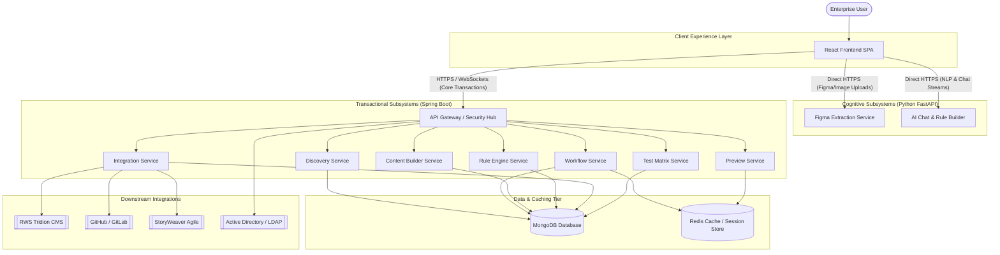

---

## 4. Component Architecture

The physical deployment of the modules is split into isolated subgraphs to enforce security boundaries and modular scalability.

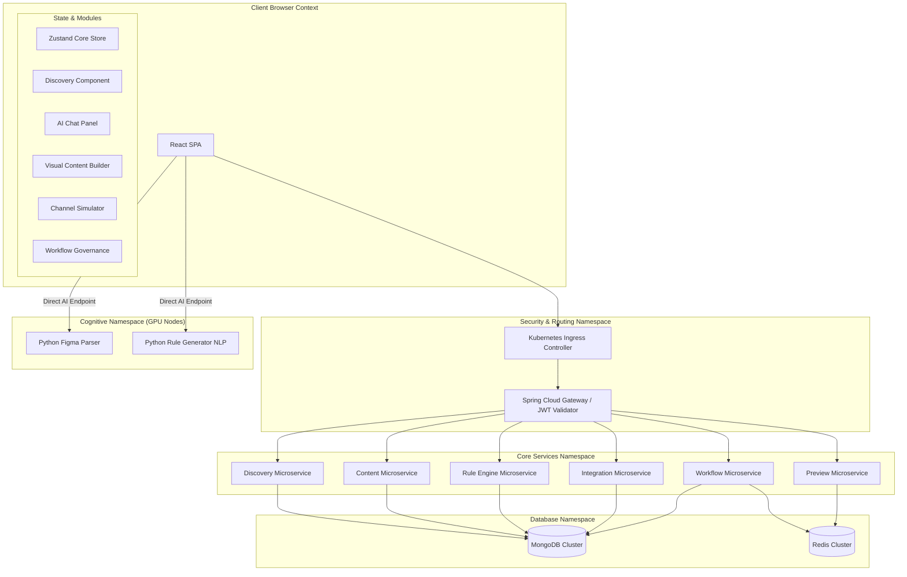

---

## 5. Domain Model (Class Diagram)

The following diagram defines the structural domain model, representing key database documents stored in MongoDB and their corresponding entity relationships.

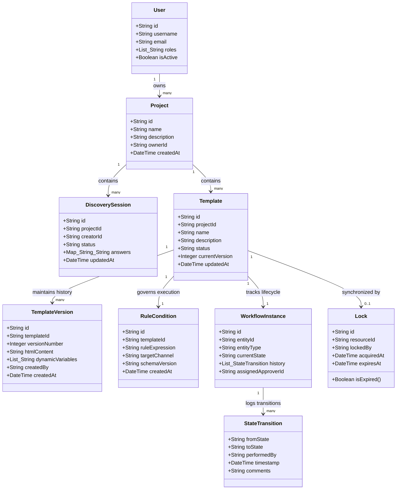

---

## 6. Sequence Diagrams & Process Flows

### Flow 1: Enterprise Authentication & RBAC Verification
Before performing operations, users authenticate against Active Directory/LDAP. The system returns a secure JWT containing role credentials used for local validation.

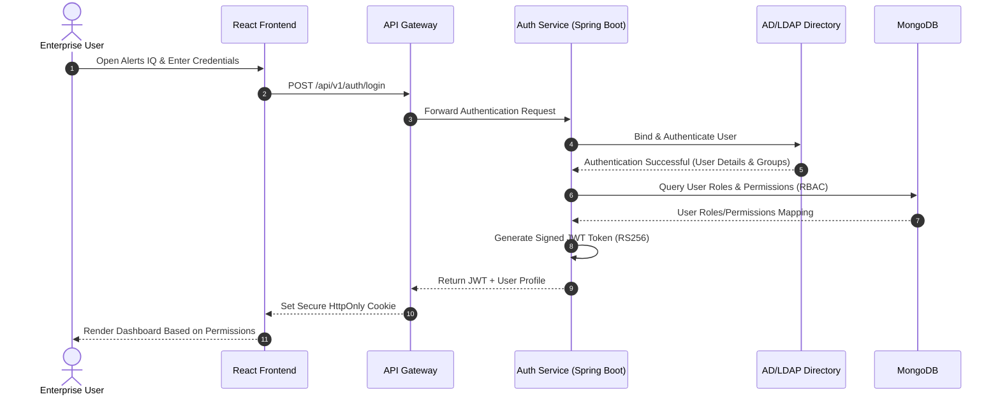

### Flow 2: Distributed Locking & Concurrency Control
To prevent conflicts during template editing, the platform manages distributed editing locks.

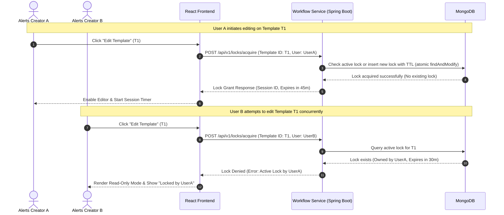

### Flow 3: Guided Discovery & Dynamic Requirement Capture
Captured requirements act as the foundational metadata for the alert generation pipeline.

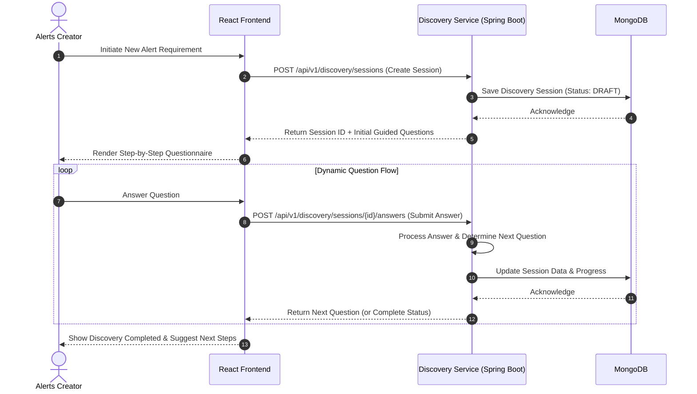

### Flow 4: Cognitive Figma/Image to HTML Layout Extraction
The React Frontend connects directly to the Python AI service to upload binary assets, bypassing the Spring API gateway to optimize throughput.

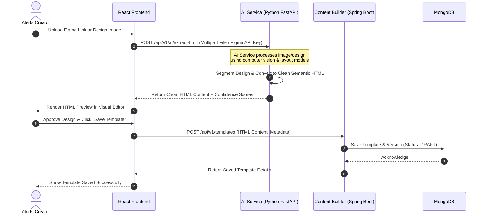

### Flow 5: Cognitive Chat Bot Rule Generation
The user interacts with an AI agent to build complex alert rules. The frontend streams prompts directly to the Python service, then validates and saves the generated rules via Spring Boot.

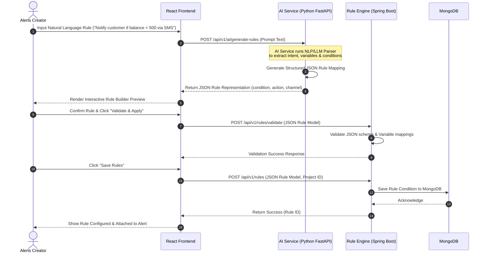

### Flow 6: Real-time Multi-Channel Template Rendering & Live Sync
The React Editor syncs updates to the Preview Service, rendering mock channels in real time.

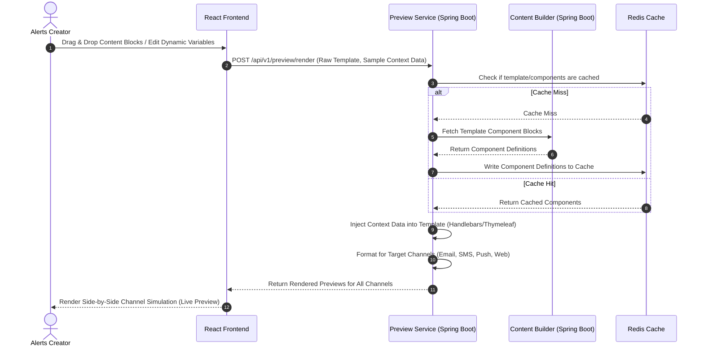

### Flow 7: Workflow Governance & Tridion CMS Publishing
Approved templates are compiled and published directly to RWS Tridion CMS from Spring Boot's Integration Service.

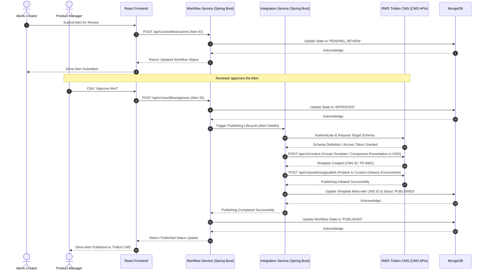

---

## 7. Workflow State Transitions

Alerts IQ templates are governed by a strict state machine to prevent unapproved designs from reaching production:

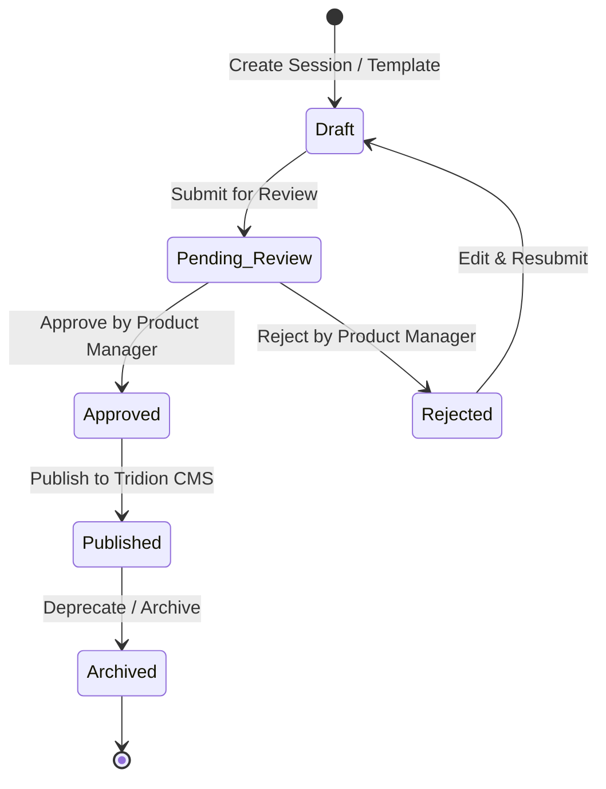

### State Management Matrix

| From State | Action / Event | Target State | Authorized Role | Description |
| :--- | :--- | :--- | :--- | :--- |
| **None** | `INITIATE_SESSION` | **Draft** | Alerts Creator | User initiates a guided questionnaire or imports a Figma design. |
| **Draft** | `SUBMIT_FOR_REVIEW` | **Pending_Review** | Alerts Creator | Requirement design complete; lock released; workflow routed to approvals queue. |
| **Pending_Review** | `APPROVE_ALERT` | **Approved** | Product Manager | Template verified for compliance, content guidelines, and rule syntax. |
| **Pending_Review** | `REJECT_ALERT` | **Draft** | Product Manager | Rejection comments attached; alert returned to creator for modifications. |
| **Approved** | `PUBLISH_TO_CMS` | **Published** | Automated / System | Triggered by Approval. The Integration Service packages the template and pushes it to Tridion CMS. |
| **Published** | `DEPRECATE_ALERT` | **Archived** | Administrator | Alert removed from the active delivery path and marked as archived. |

---

## 8. Core Services & Subsystem Design (Spring Boot)

The platform backend is built as a set of modular Spring Boot services:

### Discovery Service
Manages requirement gathering questionnaires. Uses a dynamic pathing engine to determine subsequent questions based on previous answers.
*   **Key Entity:** `DiscoverySession`
*   **Database Interactions:** Stores answer sets and progress state in MongoDB.

### Workflow Service
Governs state transitions, approvals, audit logs, and resource locking. Implements state transition validation logic.
*   **Key Entity:** `WorkflowInstance`, `Lock`, `AuditLog`
*   **Database Interactions:** Updates workflow state. Uses Redis for active editing locks and MongoDB for persistent audit history.

### Content Builder Service
Coordinates visual layouts, dynamic placeholders, multi-channel templates, and template version history.
*   **Key Entity:** `Template`, `TemplateVersion`
*   **Database Interactions:** Manages version histories in MongoDB.

### Rule Engine Service
Validates logical rule syntax and translates business conditions into structured criteria.
*   **Key Entity:** `RuleCondition`
*   **Database Interactions:** Stores compiled rule conditions mapped to templates in MongoDB.

### Preview Service
Performs real-time template compilation, variable interpolation, and multi-channel rendering.
*   **Key Entity:** None (Stateless Service)
*   **Database Interactions:** Uses Redis to cache compiled components for faster rendering performance.

### Integration Service
Maintains outbound adapters and protocols to interface with external systems.
*   **Key Entity:** Integration Meta Documents
*   **Database Interactions:** Logs interaction metadata. Connects to RWS Tridion CMS via REST APIs, GitLab/GitHub via OAuth-secured Git APIs, and StoryWeaver via REST.

### Test Matrix Service
Generates test cases, links inputs to output channels, and tracks test coverage.
*   **Key Entity:** `TestCase`, `TestExecutionLog`
*   **Database Interactions:** Writes execution logs and coverage reports to MongoDB.

---

## 9. Cognitive Subsystem Design (Python FastAPI)

The Python FastAPI subsystem handles compute-intensive cognitive tasks. Bypassing the core Spring Gateway for these tasks avoids gateway thread starvation from large file transfers and streaming text responses.

### Figma & Image Layout Extraction Subsystem
*   **Pipeline:** Accepts design images or Figma API nodes via direct multipart file upload.
*   **Model:** Passes inputs through a semantic segmentation model to classify blocks (such as text, images, buttons) followed by an LLM-based layout generation pipeline.
*   **Output:** Returns clean, responsive HTML/CSS structures and a confidence rating.

### Rule Generator & NLP Subsystem
*   **Pipeline:** Accepts natural language prompt text.
*   **Model:** Uses a fine-tuned text-to-JSON transformer model.
*   **Output:** Returns structured JSON rules containing inputs, operators, thresholds, and target channels.

---

## 10. Data & Schema Design

### MongoDB Collection Specifications

#### Users (`users` collection)
```json
{
  "_id": "ObjectId",
  "username": "String",
  "email": "String",
  "roles": ["String"],
  "isActive": "Boolean",
  "createdAt": "ISODate"
}
```
*   *Indexes:* `{ username: 1 }` (Unique), `{ email: 1 }` (Unique)

#### Templates (`templates` collection)
```json
{
  "_id": "ObjectId",
  "projectId": "String",
  "name": "String",
  "description": "String",
  "status": "String",
  "currentVersion": "Int32",
  "createdAt": "ISODate",
  "updatedAt": "ISODate"
}
```
*   *Indexes:* `{ projectId: 1 }`, `{ status: 1 }`

#### Template Versions (`template_versions` collection)
```json
{
  "_id": "ObjectId",
  "templateId": "ObjectId",
  "versionNumber": "Int32",
  "htmlContent": "String",
  "dynamicVariables": ["String"],
  "createdBy": "String",
  "createdAt": "ISODate"
}
```
*   *Indexes:* `{ templateId: 1, versionNumber: -1 }` (Unique compound index)

#### Rule Conditions (`rule_conditions` collection)
```json
{
  "_id": "ObjectId",
  "templateId": "ObjectId",
  "ruleExpression": "String",
  "targetChannel": "String",
  "schemaVersion": "String",
  "createdAt": "ISODate"
}
```
*   *Indexes:* `{ templateId: 1 }`

#### Workflow Instances (`workflow_instances` collection)
```json
{
  "_id": "ObjectId",
  "entityId": "ObjectId",
  "entityType": "String",
  "currentState": "String",
  "history": [
    {
      "fromState": "String",
      "toState": "String",
      "performedBy": "String",
      "timestamp": "ISODate",
      "comments": "String"
    }
  ],
  "assignedApproverId": "String"
}
```
*   *Indexes:* `{ entityId: 1 }`, `{ currentState: 1 }`

#### Active Locks (`locks` collection)
```json
{
  "_id": "ObjectId",
  "resourceId": "ObjectId",
  "lockedBy": "String",
  "acquiredAt": "ISODate",
  "expiresAt": "ISODate"
}
```
*   *Indexes:* `{ resourceId: 1 }` (Unique), `{ expiresAt: 1 }` (TTL Index: `expireAfterSeconds: 0`)

---

## 11. Deployment & Infrastructure Topology

The system is deployed on Kubernetes (EKS/AKS) using distinct namespaces to separate concerns. Cognitive workloads are deployed on GPU-enabled node pools.

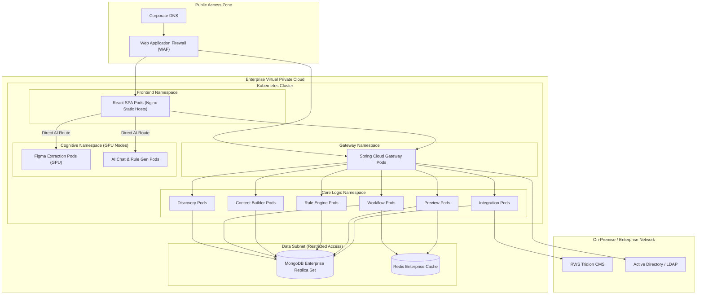

---

## 12. Security, Compliance & Governance

### Identity & Access Management
*   **Authentication:** Federated identity mapping via Active Directory/LDAP using OAuth2/OIDC.
*   **Authorization:** Role-Based Access Control (RBAC) enforced at the API Gateway and verified by microservices.

| Role | Permissions |
| :--- | :--- |
| **Alerts Creator** | Create sessions, edit templates, request edit locks, execute AI tasks, submit for review. |
| **Product Manager** | Review pending alert designs, approve workflow states, override active edit locks. |
| **Administrator** | Configure integrations, manage users, set platform configuration, purge active locks. |

### Data Security
*   **In-Transit:** All internal and external network traffic is encrypted using TLS 1.3.
*   **At-Rest:** Data stored in MongoDB is encrypted using AES-256 (XTS mode).
*   **Data Masking:** PII scrubbing middleware filters inputs before sending prompt text to Python AI LLM models.
*   **Audit Logging:** Changes to templates, rules, and workflows are recorded to an immutable collection with fields including timestamp, user, action, and state delta.

---

## 13. Observability & Monitoring

The monitoring stack provides end-to-end visibility into platform health, transaction traces, and model performance:

*   **Metrics Collection:** **Prometheus** scrapes JVM stats from Spring Boot Actuator endpoints, Python resource utilization from FastAPI, and query latency from MongoDB.
*   **Visualization:** **Grafana** dashboards track system performance (such as API latency, error rates, and active user sessions).
*   **Centralized Logging:** **ELK Stack** (Elasticsearch, Logstash, Kibana) aggregates structured JSON logs across all namespaces.
*   **Distributed Tracing:** **OpenTelemetry** traces transactions across microservices, including downstream integrations (such as RWS Tridion CMS) and Python AI services, to isolate latency bottlenecks.

---

## 14. Fault Tolerance & Resilience

To prevent cascading failures across microservices, the following resilience strategies are implemented:

*   **Circuit Breaker Pattern (Resilience4j):** Applied to outbound connections, particularly to RWS Tridion CMS and the Python AI services. If a downstream service fails, the circuit opens to protect core system threads.
*   **Graceful Degradation Fallbacks:**
    *   *AI Service Down:* The UI replaces the AI chat interface and Figma parser with manual visual builders and standard text editors.
    *   *Redis Cache Down:* The system routes locking and rendering tasks to MongoDB.
*   **Database High Availability:** MongoDB runs in a three-node replica set with auto-failover, ensuring database operations continue if the primary node goes offline.

---

## 15. Non-Functional Requirements (NFRs)

### Availability & Reliability
*   **Uptime SLA:** Target of 99.9% uptime (excluding scheduled maintenance).
*   **Recovery Objective:** Recovery Time Objective (RTO) < 15 minutes, Recovery Point Objective (RPO) < 5 minutes.
*   **Redundancy:** Multi-AZ (Availability Zone) active-active pod deployments, coupled with multi-node database clustering.

### Scalability
*   **Horizontal Autoscaling:** Kubernetes Horizontal Pod Autoscaler (HPA) scales pods up or down based on CPU and memory usage (threshold: 70% utilization).
*   **GPU Isolation:** AI workloads run on dedicated GPU-accelerated nodes (such as Amazon EC2 g4dn/g5 instances) to prevent compute starvation in core transaction environments.
*   **Database Scalability:** MongoDB replica sets support read scaling via secondary nodes, and are configured for sharding if collection sizes exceed 10TB.

### Performance & Latency
*   **Transactional APIs:** 95% of standard REST API transactions return in < 200ms.
*   **Live Preview Compilation:** Dynamic template rendering compiles in < 100ms using Redis caching.
*   **AI Chat Streams:** First token delivery (TTFT) for generative rule chat responses returns in < 500ms using server-sent events (SSE).
*   **Concurrency:** Supports up to 1,000 concurrent active users and 100 simultaneous visual template edits.

### Maintainability & Portability
*   **API Standardization:** All APIs conform to the OpenAPI 3.0 specification.
*   **Containerization:** Subsystems are built as OCI-compliant container images to allow deployment across Kubernetes distributions.
*   **Configuration Management:** Microservices externalize configuration properties using Spring Cloud Config or Kubernetes ConfigMaps.
