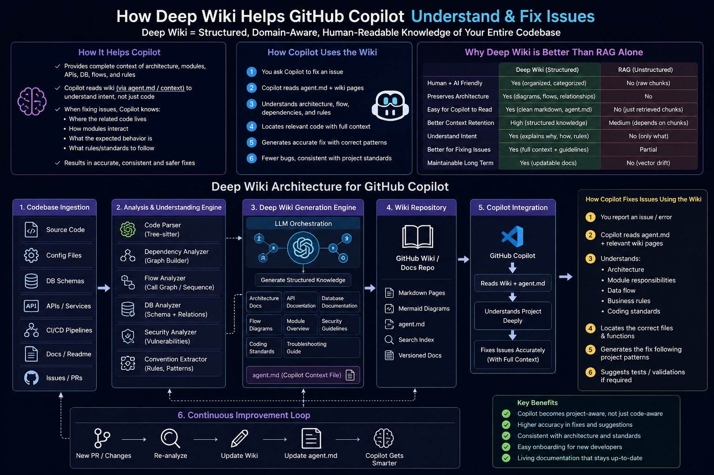

# Deep Wiki Architecture for GitHub Copilot
## Enterprise Documentation for Business & Engineering Teams

---

# 1. Executive Summary

Deep Wiki is an AI-powered knowledge generation system that automatically understands a software codebase and creates structured documentation for both developers and business users.

Unlike traditional documentation systems, Deep Wiki continuously analyzes:
- Source code
- APIs
- Databases
- Business rules
- Dependencies
- Security flows
- CI/CD pipelines

The generated wiki helps GitHub Copilot and AI agents understand the project deeply, enabling:
- Better issue fixing
- Faster onboarding
- More accurate code generation
- Architecture-aware AI assistance
- Enterprise knowledge management

---

# 2. Problem Statement

Large enterprise applications contain:
- Thousands of files
- Multiple services
- Complex APIs
- Database relationships
- Business rules
- Hidden dependencies

Traditional AI/RAG systems struggle because:
- They only retrieve code chunks
- They lack architectural understanding
- They do not understand business intent
- They miss relationships between modules

As a result:
- AI generates incorrect fixes
- Developers spend time explaining context
- Onboarding is slow
- Knowledge remains tribal

Deep Wiki solves this problem.

---

# 3. What is Deep Wiki?

Deep Wiki is a structured knowledge system generated from the codebase using AI and static analysis.

It creates:
- Architecture documentation
- API documentation
- Database documentation
- Flow diagrams
- Dependency maps
- Security guidelines
- Troubleshooting guides
- Coding standards
- Agent instructions (agent.md)

The wiki becomes the “brain” of the project.

---

# 4. High-Level Architecture

## Overall Flow

```text
Git Repository
      ↓
Code Analysis Engine
      ↓
AI Understanding Layer
      ↓
Deep Wiki Generator
      ↓
Markdown + Diagrams + agent.md
      ↓
GitHub Copilot / AI Agents
      ↓
Smarter Issue Resolution
```

---

# 5. Deep Wiki Architecture Diagram



---

# 6. How Deep Wiki Helps GitHub Copilot

## Without Deep Wiki

GitHub Copilot only sees:
- Current file
- Nearby code
- Limited repository context

Problems:
- Cannot understand full architecture
- Misses business rules
- Suggests incorrect fixes
- Generates inconsistent code

---

## With Deep Wiki

Copilot receives:
- Architecture understanding
- Module relationships
- Business workflows
- Coding standards
- Security patterns
- API contracts
- Database relationships

Result:
- More accurate fixes
- Better code suggestions
- Safer refactoring
- Faster issue resolution

---

# 7. How Copilot Uses the Wiki

## Step-by-Step Flow

### Step 1 — User Reports an Issue

Example:
“Payment API fails during invoice generation.”

---

### Step 2 — Copilot Reads Context

Copilot accesses:
- agent.md
- API documentation
- Flow diagrams
- Payment service documentation

---

### Step 3 — Copilot Understands the System

AI now understands:
- Which services are involved
- How data flows
- Which database tables are used
- Expected business behavior
- Security validations

---

### Step 4 — Copilot Locates Relevant Code

Instead of searching blindly, Copilot identifies:
- Exact modules
- Related services
- Dependent APIs
- Validation layers

---

### Step 5 — Copilot Generates Better Fixes

Because the AI understands architecture:
- Fixes align with standards
- Existing patterns are reused
- Side effects are reduced
- Security rules are respected

---

# 8. Why Deep Wiki is Better Than Traditional RAG

## What is RAG?

RAG (Retrieval-Augmented Generation) retrieves chunks of code or documents from a vector database and sends them to the LLM.

Typical Flow:

```text
User Question
      ↓
Vector Search
      ↓
Retrieve Similar Chunks
      ↓
Send to LLM
      ↓
Generate Response
```

---

# 9. Problems with Traditional RAG

## 1. No Architecture Understanding

RAG retrieves chunks independently.

It does NOT understand:
- Service relationships
- Business flows
- Module responsibilities

---

## 2. Context Fragmentation

Retrieved chunks may:
- Come from unrelated files
- Miss dependencies
- Lack business meaning

---

## 3. No Long-Term Project Knowledge

RAG only retrieves text similarity.

It does not maintain:
- Design intent
- Standards
- Workflow rules

---

## 4. Difficult for Business Users

Raw code chunks are not human-friendly.

Business teams need:
- Structured documentation
- Visual flows
- Business explanations

---

# 10. Why Deep Wiki is Superior

## Deep Wiki Adds Structure

Instead of raw chunks, it creates:
- Organized documentation
- Domain knowledge
- Relationships
- Architecture maps

---

## Deep Wiki Preserves Meaning

It understands:
- Why a module exists
- How systems interact
- Business logic purpose

---

## Deep Wiki is Human + AI Friendly

Both developers and business users can understand it.

---

# 11. Comparison Table

| Feature | Traditional RAG | Deep Wiki |
|---|---|---|
| Retrieves Similar Text | Yes | Yes |
| Understands Architecture | No | Yes |
| Business Flow Awareness | No | Yes |
| Human-Friendly Documentation | Limited | Excellent |
| Copilot Understanding | Partial | Deep |
| Dependency Mapping | Weak | Strong |
| Supports Business Users | Poor | Excellent |
| Long-Term Maintainability | Medium | High |

---

# 12. Components of Deep Wiki System

# A. Code Ingestion Layer

Responsible for collecting:
- Source code
- Configurations
- APIs
- Schemas
- CI/CD pipelines

Tools:
- GitHub APIs
- File scanners
- Repository parsers

---

# B. Analysis Engine

Analyzes:
- Dependencies
- Call flows
- Security patterns
- Database relationships

Technologies:
- Tree-sitter
- AST parsers
- Graph builders

---

# C. AI Understanding Layer

Uses LLMs to:
- Understand business logic
- Explain workflows
- Generate summaries
- Build diagrams

Models:
- GPT
- Claude
- Phi
- Azure OpenAI

---

# D. Wiki Generation Layer

Generates:
- Markdown pages
- Mermaid diagrams
- Architecture documentation
- agent.md

---

# E. Copilot Integration Layer

Allows:
- GitHub Copilot
- VSCode agents
- Internal AI systems

to use the wiki as context.

---

# 13. What is agent.md?

agent.md is a special AI instruction file.

It teaches Copilot:
- Architecture rules
- Folder purposes
- Coding standards
- Business constraints
- Security requirements

Example:

```markdown
# Authentication Rules

- All APIs must validate JWT tokens
- Never bypass RBAC checks
- Use AuthService for token validation
```

This dramatically improves AI quality.

---

# 14. Enterprise Use Cases

## A. Vulnerability Remediation

Flow:
- Upload XLSX vulnerabilities
- AI maps issue to code
- Deep Wiki explains affected system
- Copilot suggests fixes
- PR generated automatically

---

## B. Developer Onboarding

New developers can quickly understand:
- System architecture
- APIs
- Data flow
- Business rules

---

## C. Impact Analysis

Before changing a module:
- Identify dependencies
- Detect impacted services
- Prevent production issues

---

## D. Compliance & Auditing

Generate:
- Security documentation
- Audit trails
- Architecture evidence

---

# 15. Continuous Improvement Loop

Deep Wiki continuously evolves.

## Flow

```text
New PR
   ↓
Re-analyze Code
   ↓
Update Wiki
   ↓
Update agent.md
   ↓
Copilot Gets Smarter
```

The system becomes more intelligent over time.

---

# 16. Recommended Enterprise Technology Stack

| Layer | Technology |
|---|---|
| Frontend | React |
| Backend | Node.js / .NET |
| Parsing | Tree-sitter |
| Vector DB | FAISS / Qdrant |
| AI Models | Azure OpenAI |
| Documentation | Markdown |
| Diagrams | Mermaid |
| Storage | GitHub Wiki / Confluence |
| Authentication | Entra ID |

---

# 17. Future Enhancements

Possible advanced features:
- Automatic PR reviews
- AI-generated test cases
- Real-time architecture graphs
- Security risk scoring
- Auto-generated sequence diagrams
- Voice-based architecture assistant

---

# 18. Business Benefits

## Faster Delivery
Teams resolve issues faster.

## Better AI Accuracy
Copilot understands architecture deeply.

## Reduced Knowledge Dependency
Knowledge is documented automatically.

## Improved Collaboration
Business and engineering teams share the same understanding.

## Better Governance
Standards and rules are enforced consistently.

---

# 19. Conclusion

Deep Wiki transforms GitHub Copilot from a simple code assistant into an architecture-aware enterprise AI engineer.

Instead of relying only on raw code retrieval:
- The system understands architecture
- Preserves business intent
- Documents relationships
- Guides AI behavior

This leads to:
- Smarter issue fixing
- Better onboarding
- Stronger governance
- Enterprise-scale AI development

Deep Wiki is not just documentation.

It is the intelligence layer of the software platform.

