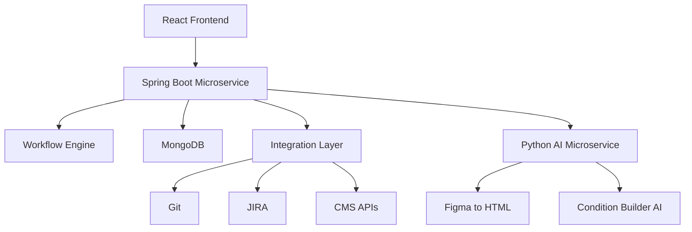
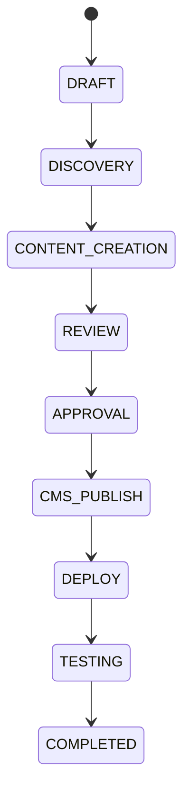
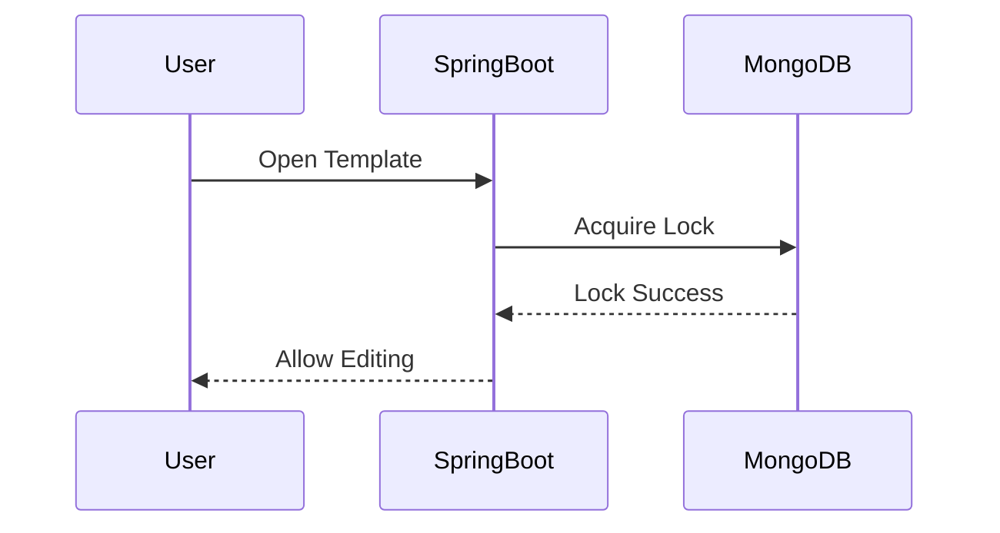

# Alerts IQ – Complete Enterprise Implementation Guide

Generated on 2026-05-27 05:54

---

# Platform Vision

Alerts IQ is an Enterprise AI Alert Engineering Platform.

---

# Core Architecture

---

# Workflow Lifecycle

---

# Distributed Locking

---

# Technology Stack

| Layer | Technology |
|---|---|
| Frontend | React + TypeScript |
| Backend | Spring Boot |
| AI | Python FastAPI |
| Database | MongoDB |
| Authentication | LDAP |
| Realtime | WebSocket |

