# Alerts IQ – Complete Enterprise Implementation Guide

# Table of Contents

1. Platform Vision
2. Business Problem
3. End-to-End Architecture
4. Enterprise Authentication & RBAC
5. Distributed Locking System
6. Guided Discovery Module
7. AI Orchestration Layer
8. Workflow Engine
9. Figma to HTML AI Pipeline
10. Dynamic Variable Engine
11. Condition Builder
12. Live Preview Architecture
13. Formatter Engine
14. CMS Publishing
15. Git Integration
16. JIRA Integration
17. MongoDB Schema Design
18. Kafka Event Architecture
19. WebSocket Realtime Architecture
20. Deployment Architecture
21. Kubernetes Architecture
22. Security Architecture
23. DevOps & CI/CD
24. Folder Structure
25. API Design
26. Recommended Sprint Plan
27. Future Enhancements

---

# 1. Platform Vision

Alerts IQ is an Enterprise AI Alert Engineering Platform.

The platform automates:

- Requirement onboarding
- Alert engineering
- Technical specification generation
- JIRA story creation
- Liquibase generation
- AI content creation
- Dynamic rules management
- CMS publishing
- Workflow governance
- Approval lifecycle
- Multi-channel rendering

---

# 2. Business Problem

Traditional alert onboarding requires:

- Multiple business meetings
- Manual documentation
- Manual JIRA creation
- Manual DB configuration
- Manual content engineering
- Manual testing
- Multiple teams

Alerts IQ automates the entire lifecycle.

---

# 3. End-to-End Enterprise Architecture

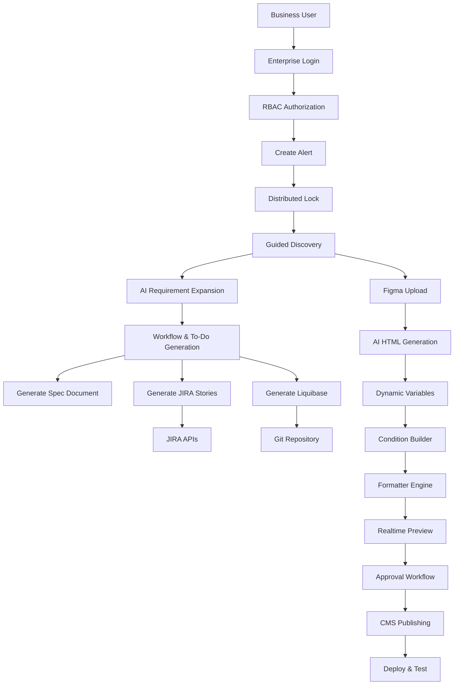

---

# 4. Enterprise Authentication & RBAC

The platform uses Enterprise Login integrated with Active Directory.

## Authentication Flow

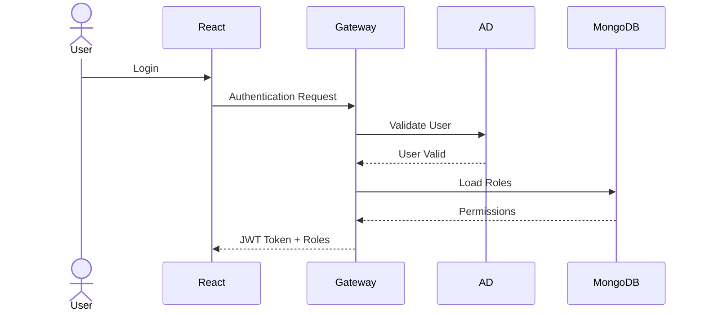

---

## RBAC Roles

| Role | Access |
|---|---|
| ADMIN | Full Access |
| BUSINESS_USER | Discovery |
| CONTENT_AUTHOR | Content Creation |
| REVIEWER | Review Workflow |
| APPROVER | Approvals |
| DEVOPS | Deployment |
| AUDITOR | Read-only Audit |

---

## MongoDB Role Model

```json
{
  "userId": "u1001",
  "roles": ["CONTENT_AUTHOR"],
  "permissions": [
    "CREATE_TEMPLATE",
    "EDIT_TEMPLATE",
    "VIEW_DISCOVERY"
  ]
}
```

---

# 5. Distributed Locking System

This prevents concurrent editing conflicts.

When a user opens a template:

1. System acquires Redis lock
2. MongoDB stores lock metadata
3. Other users are blocked
4. Heartbeat renews lock
5. Lock auto expires

---

## Locking Architecture

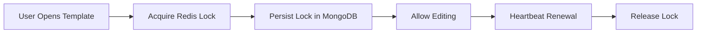

---

## Lock Collection

```json
{
  "resourceId": "template-1001",
  "lockedBy": "john.doe",
  "lockedAt": "2026-05-26T10:00:00Z",
  "expiresAt": "2026-05-26T10:30:00Z",
  "status": "ACTIVE"
}
```

---

# 6. Guided Discovery Module

This is the first phase of Alerts IQ.

The system dynamically asks questions.

---

## Discovery Features

- Business requirement intake
- Dynamic questionnaires
- Smart recommendations
- AI-assisted suggestions
- In-context help
- Action items
- Follow-ups
- To-do generation

---

## Discovery Architecture

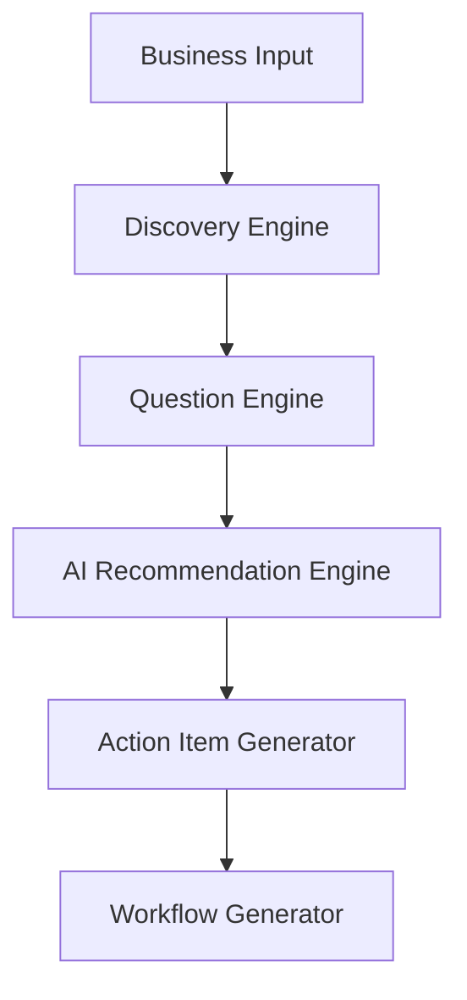

---

## Discovery Example

User enters:

- Message Name
- Channel
- Message Purpose
- From Address
- CTA Link

AI automatically:

- Suggests configurations
- Generates follow-up items
- Generates JIRA stories
- Creates specifications

---

# 7. AI Orchestration Layer

The AI Layer is the brain of Alerts IQ.

---

## AI Services

| AI Service | Purpose |
|---|---|
| Discovery AI | Requirement expansion |
| HTML Generator AI | Figma to HTML |
| Variable AI | Detect placeholders |
| Rule AI | Generate conditions |
| Formatter AI | Suggest formatters |
| Story AI | Generate JIRA stories |
| Liquibase AI | Generate DB scripts |

---

## AI Architecture

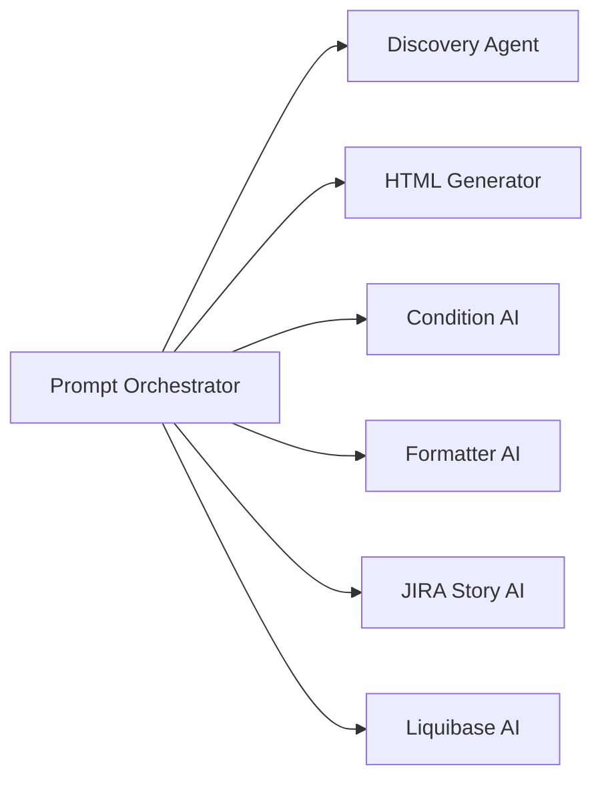

---

## Recommended AI Stack

| Area | Technology |
|---|---|
| AI APIs | FastAPI |
| Orchestration | LangGraph |
| OCR | PaddleOCR |
| Validation | Pydantic |
| Prompting | Jinja2 |
| Vector Search | FAISS |

---

# 8. Workflow Engine

Every template follows workflow stages.

---

## Workflow States

```text
DRAFT
DISCOVERY
CONTENT_CREATION
REVIEW
APPROVAL
PUBLISH
DEPLOY
TEST
COMPLETED
```

---

## Workflow Diagram

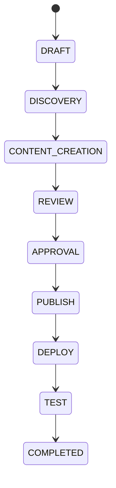

---

## Workflow Features

- Role-based approvals
- State transitions
- Audit trail
- Notifications
- Workflow history
- SLA monitoring

---

# 9. Figma to HTML AI Pipeline

This converts business Figma designs into editable HTML.

---

## AI Conversion Flow

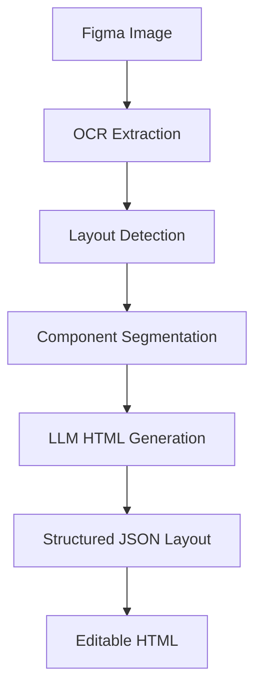

---

## Internal Canonical Model

```json
{
  "layout": {},
  "html": "",
  "variables": [],
  "conditions": [],
  "formatters": []
}
```

---

# 10. Dynamic Variable Engine

Variables are auto-detected from HTML.

---

## Example Variables

```text
{{customerName}}
{{maskedCard}}
{{transactionAmount}}
```

---

## Variable Flow

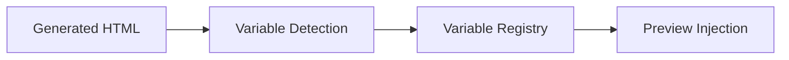

---

## Variable Model

```json
{
  "name": "customerName",
  "type": "string",
  "formatter": "capitalize"
}
```

---

# 11. Condition Builder

Users create conditions using AI chat.

Example:

“If customer is premium show premium banner.”

AI converts this into JSON rules.

---

## Condition Architecture

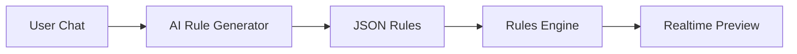

---

## Example Rule

```json
{
  "condition": "customerType == 'PREMIUM'",
  "action": {
    "showBlock": "premiumBanner"
  }
}
```

---

# 12. Live Preview Architecture

Preview updates immediately.

---

## Live Preview Flow

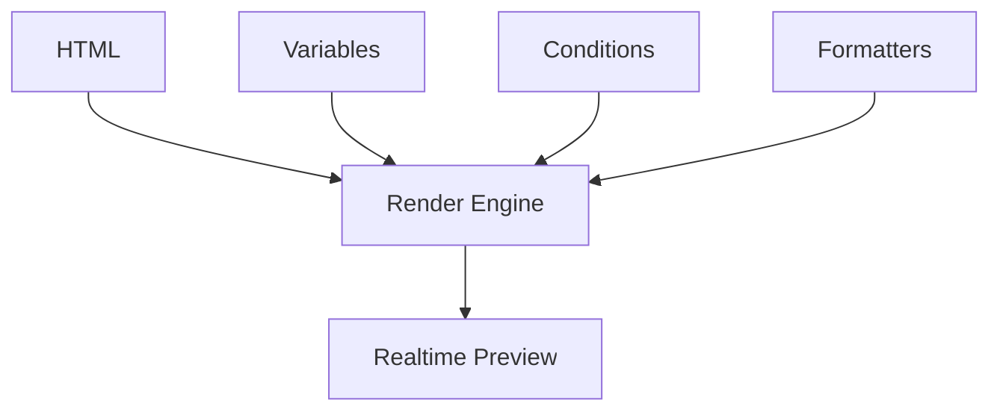

---

## Live Features

- Multi-channel preview
- Variable simulation
- Real-time rendering
- Dynamic conditions
- Device preview

---

# 13. Formatter Engine

Formatters transform raw values.

---

## Examples

```text
currency()
maskCard()
uppercase()
dateFormat()
truncate()
```

---

## Formatter Pipeline

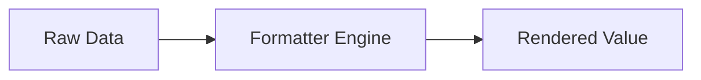

---

# 14. CMS Publishing

Once approved:

1. HTML converted into CMS payload
2. CMS APIs invoked
3. Template published

---

## CMS Architecture

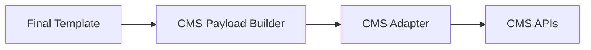

---

# 15. Git Integration

The platform automatically commits:

- Liquibase
- Specs
- Configurations
- JSON payloads

---

## Git Flow

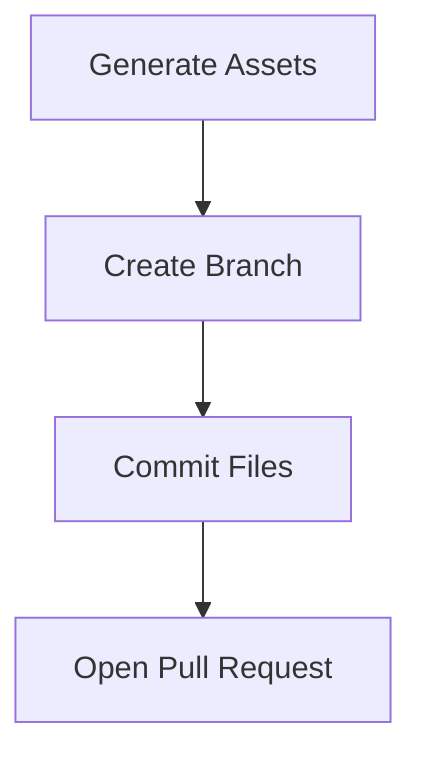

---

# 16. JIRA Integration

AI generates:

- Epics
- Features
- Stories
- Acceptance Criteria
- Tasks

---

## JIRA Architecture

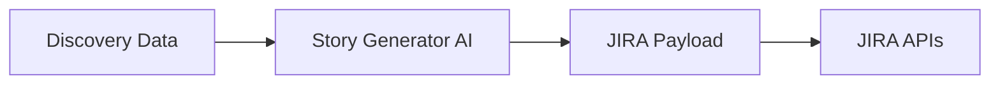

---

# 17. MongoDB Schema Design

---

## Recommended Collections

```text
users
roles
permissions
sessions
locks
templates
template_versions
variables
conditions
formatters
workflows
audit_logs
jira_integrations
cms_publish_logs
```

---

# 18. Kafka Event Architecture

All services communicate asynchronously.

---

## Kafka Topics

```text
workflow-events
template-events
preview-events
ai-events
jira-events
cms-events
audit-events
```

---

## Event Flow

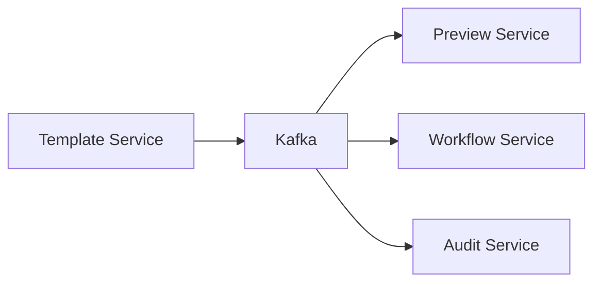

---

# 19. WebSocket Realtime Architecture

Realtime updates include:

- Preview updates
- Lock notifications
- AI progress
- Workflow changes

---

## WebSocket Flow

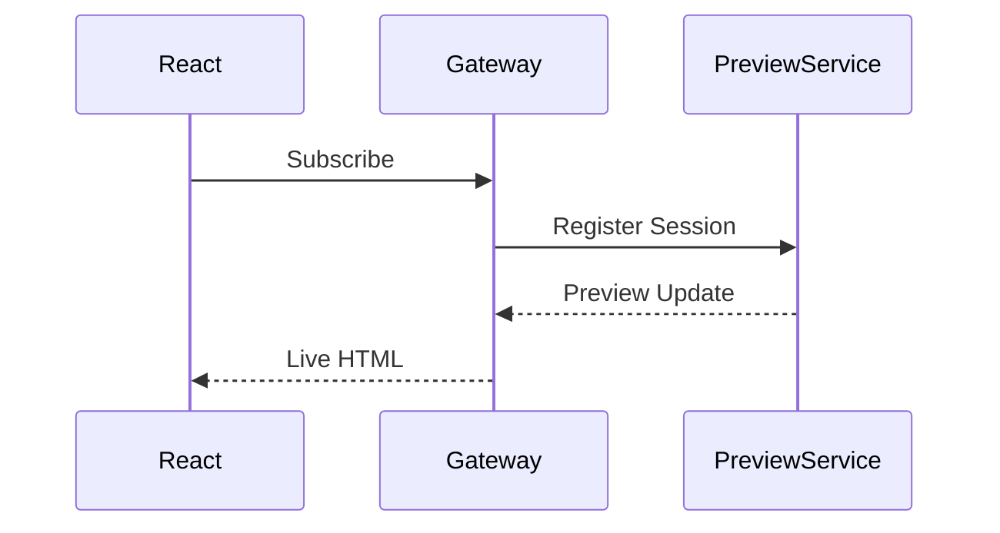

---

# 20. Deployment Architecture

---

## Kubernetes Architecture

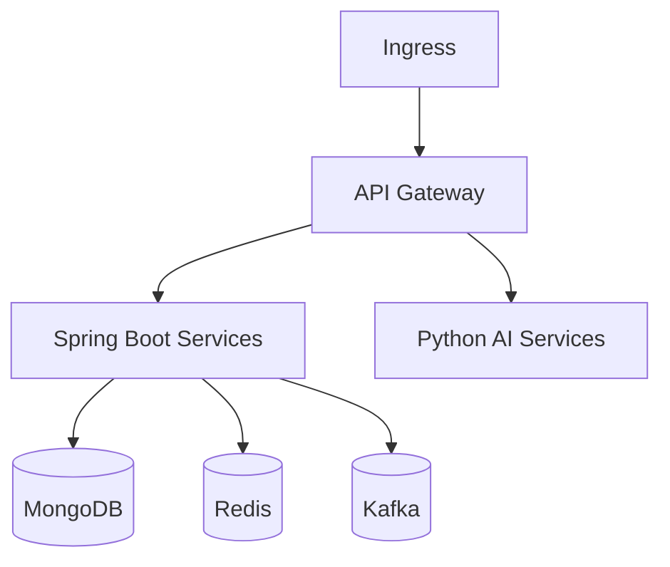

---

# 21. DevOps & CI/CD

---

## Deployment Pipeline

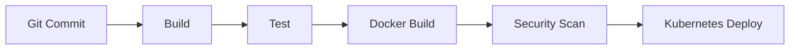

---

# 22. Security Architecture

---

## Security Features

- AD Authentication
- OAuth2
- RBAC
- JWT
- PII masking
- Audit logging
- Prompt auditing
- HTML sanitization
- CSP headers

---

# 23. Recommended Tech Stack

| Layer | Technology |
|---|---|
| Frontend | React + TypeScript |
| Backend | Spring Boot |
| AI | Python FastAPI |
| AI Orchestration | LangGraph |
| Database | MongoDB |
| Cache | Redis |
| Queue | Kafka |
| Realtime | WebSocket |
| Deployment | Kubernetes |
| Monitoring | Prometheus + Grafana |

---

# 24. Recommended Folder Structure

## Frontend

```text
/apps
/components
/services
/store
/hooks
/utils
```

---

## Backend

```text
/services
  /gateway-service
  /workflow-service
  /template-service
  /preview-service
```

---

## AI Layer

```text
/ai-services
  /prompt-orchestrator
  /html-generator
  /rule-generator
  /formatter-engine
```

---

# 25. API Design

## Discovery APIs

```text
POST /discovery/start
POST /discovery/answers
GET /discovery/questions
```

---

## Workflow APIs

```text
POST /workflow/start
POST /workflow/transition
GET /workflow/history
```

---

## Template APIs

```text
POST /template/create
POST /template/preview
POST /template/publish
```

---

# 26. Recommended Implementation Phases

## Phase 1

- Enterprise Login
- RBAC
- Discovery Module
- Workflow Engine
- MongoDB Models

---

## Phase 2

- AI Orchestration
- Figma to HTML
- Dynamic Variables
- Preview Engine

---

## Phase 3

- Condition Builder
- Formatter Engine
- CMS Publishing
- Git Integration
- JIRA Integration

---

## Phase 4

- Observability
- SLA Engine
- Multi-user Collaboration
- AI Governance

---

# 27. Final Recommendation

Alerts IQ is not just a content management platform.

It is:

# Enterprise AI Alert Engineering Platform

The platform combines:

- AI
- Workflow governance
- Enterprise integrations
- Content engineering
- Real-time rendering
- DevOps automation
- Publishing automation

inside one unified enterprise ecosystem.

